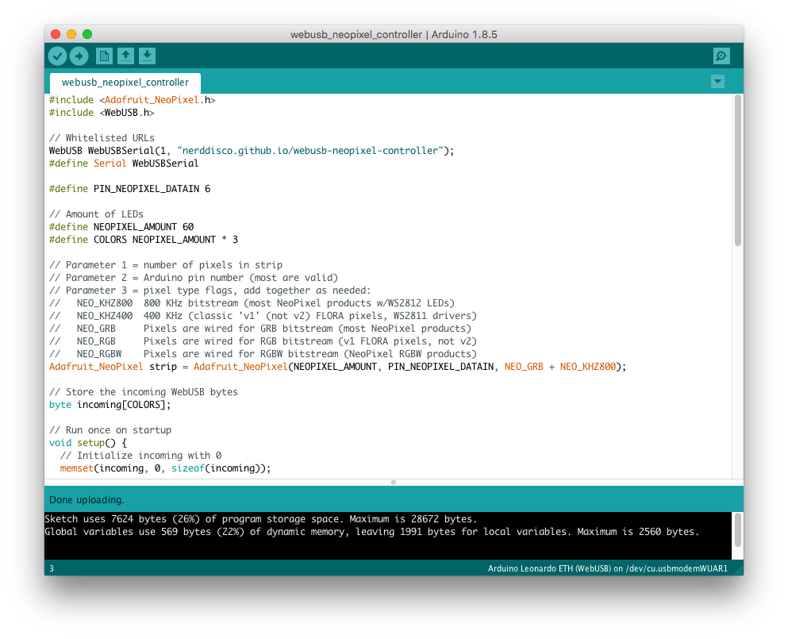
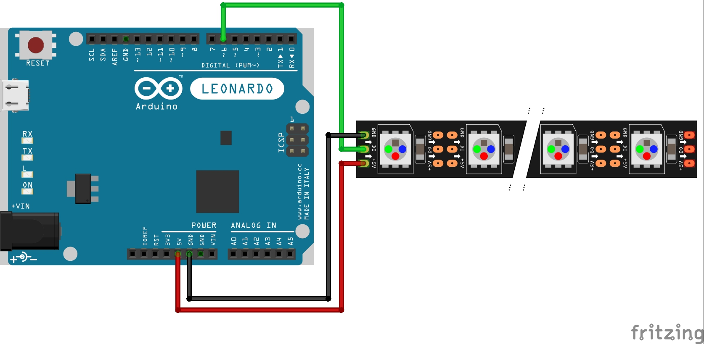

# WebUSB NeoPixel Controller

[](https://github.com/NERDDISCO/webusb-neopixel-controller/releases/tag/1.0.0)

Manage a NeoPixels with an Arduino-based controller directly from the browser by leveraging WebUSB.

👉 To fully understand the background of this module you should read the article [How to build a WebUSB DMX512 Controller by using an Arduino](https://medium.com/@timpietrusky/how-to-build-a-webusb-dmx512-controller-by-using-an-arduino-e0dd8efb7bf0). 👈

## Table of Contents

<!-- toc -->

- [WebUSB NeoPixel Controller](#webusb-neopixel-controller)
  - [Table of Contents](#table-of-contents)
  - [ES6 module](#es6-module)
    - [Install](#install)
    - [API Documentation](#api-documentation)
    - [Usage](#usage)
    - [Browser Support](#browser-support)
  - [Arduino](#arduino)
    - [Models](#models)
    - [Sketch](#sketch)
  - [NeoPixels](#neopixels)
    - [Connect to Arduino](#connect-to-arduino)
  - [Demo](#demo)
    - [Run locally](#run-locally)

<!-- tocstop -->

---

## ES6 module

The module can be used in projects where you want to control a NeoPixel controller over WebUSB. It's written in JavaScript and contains only one Class called `Controller`.

### Install

Install the `webusb-neopixel-controller` module into your project:

```
npm install webusb-neopixel-controller
```


### API Documentation

Can be found on [API documentation](docs/API.md).


### Usage

```javascript
import Controller from 'webusb-neopixel-controller/controller.js'

const controller = new Controller({ leds: 30 })
const activateButton = document.getElementById('activateWebUsb')

// Listen for click events on the activate button, because
// `controller.enable` must be triggered by a user gesture
activateButton.addEventListener('click', e => {

  // Enable WebUSB and select the Arduino
  controller.enable().then(() => {

    // Create a connection to the selected Arduino
    controller.connect().then(() => {

      // Set the 1 LED of the NeoPixel strip to yellow (rgb(255, 255, 0))
      controller.update(1, [255, 0, 255])
    })
  })
})
```

Also make sure to take a look the [code behind the demo](#demo) to get more usage examples.

The module is also used in [luminave](https://github.com/NERDDISCO/luminave).


### Browser Support

In order to use the module you have to use a browser that supports WebUSB:

* Chrome 61 + 62: Behind flags
  * `chrome://flags/#enable-experimental-web-platform-features`
* Chrome 63+: Native support

---

## Arduino 

To transform the Arduino into a WebUSB NeoPixel Controller, you need to get some code:


```bash
# Clone the repository
git clone git@github.com/NERDDISCO/webusb-neopixel-controller.git

# Get dependencies
git submodule init
git submodule update
```

It clones the following submodules:

* [Adafruit_NeoPixel](https://github.com/adafruit/Adafruit_NeoPixel)

### Models

The code was tested on these Arduino:

* [Arduino Leonardo](https://store.arduino.cc/arduino-leonardo-with-headers)
* Arduino Leonardo ETH
* Seeeduino Lite


### Sketch

The code that runs on the Arduino is organized in a Sketch. In order to use the sketch from this repository, you have to follow these steps:

1. Download & install the [Arduino IDE](https://www.arduino.cc/en/Main/Software#download) >= 1.8.5, so you are able to write & push code onto the Arduino
2. Open the Arduino IDE
3. Open the preferences: *Arduino > Preferences*
4. In the preferences dialog you have to change the *Sketchbook location* so that it points to the *sketchbook* folder that comes with the repository:

  
5. Close the Arduino IDE and then open it again (this is needed to load the new sketchbook that we selected in the step before)
6. Now we need to configure the Arduino IDE so that it can recognize our Arduino Leonardo:
   1. Select the model: *Tools > Board > Arduino Leonardo (WebUSB)* (or one of the other supported boards underneath the *NERDDISCO: WebUSB NeoPixel Controller* headline in the menu)
     
   2. Select the USB port: *Tools > Port > /dev/tty.usbmodem$* (The $ is a placeholder and will be different for every Arduino you are using)

    **Attention**: This can only be selected if your Arduino is actually attached to your computer via USB!
7. Open the sketch (if it's not already open): *File > Sketchbook > webusb_neopixel_controller*
8. Verify that the sketch is working: *Sketch > Verify/Compile*. This will produce an output like this:
```sh
  Sketch uses 7624 bytes (26%) of program storage space. Maximum is 28672 bytes.
  Global variables use 569 bytes (22%) of dynamic memory, leaving 1991 bytes for local variables. Maximum is 2560 bytes.
```
9. Upload the sketch to the Arduino: *Sketch > Upload* This will produce a similar output as step 10.

**Attention**: If the steps 8 or 9 did not work as promised, [please open an issue on GitHub](https://github.com/NERDDISCO/webusb-neopixel-controller/issues)

When you are done your Arduino IDE should look like this:




---

## NeoPixels

You can use any [NeoPixels](https://www.adafruit.com/category/168) and (in theory) every other LED that is based on the WS2812 or SK6812 chipset. 

### Connect to Arduino

For testing purposes you can connect the NeoPixels directly to the Arduino. 

**Caution**: This only works if you are using less than 30 NeoPixels at the same time. Everything else will require an external power source. In order to handle that you [should read the guide from Adafruit](https://learn.adafruit.com/adafruit-neopixel-uberguide/basic-connections). 

**Caution**: The order of the three pins can vary between different strip densities and batches. ALWAYS use the labels printed ON THE STRIP. Look closely, NEVER blindly follow a NeoPixel strip wiring diagram; it might be based on a different strip type!




---


## Demo

In order to test the WebUSB NeoPixel Controller directly in the browser you can use the [demo on GitHub](https://nerddisco.github.io/webusb-neopixel-controller). The [code behind the demo](https://github.com/NERDDISCO/webusb-neopixel-controller/tree/master/demo) can be found in the repository.

### Run locally

* Clone [this repository](https://github.com/NERDDISCO/webusb-neopixel-controller)
* Install the dev dependencies by executing `npm install` inside the repository
* Execute `npm start` to start the local web server
* Open the demo on [localhost:8080](http://localhost:8080)